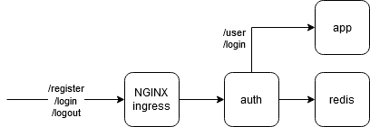
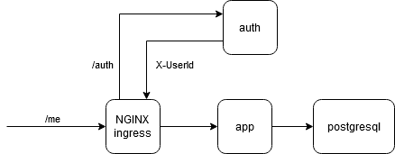

Архитектура решения

### Приложение auth

- предоставляет внешний API для регистрации ("/register") и авторизации пользователей по паролю ("/login", "/logout")
- предоставляет внутренний API для авторизации через token, передаваемый в cookie "session-id" ("/auth")
- все операции над пользователями выполняет через app
- хранит сессии авторизации в redis



### Приложение app

- предоставляет внешний API для получения/изменения текущего авторизованного пользователя ("/me")
- авторизация происходит на Nginx Ingress через приложение auth
- предоставляет внутренний API CRUD для пользователей
- хранит пользователей в postgres



### Запуск приложения
```
minikube addons enable ingress
kubectl create namespace sample
helm install app-chart ./app/app-chart -n sample
helm install auth-chart ./auth/auth-chart -n sample
```

### Запуск тестов
```
newman run sample_auth.postman_collection.json
```
