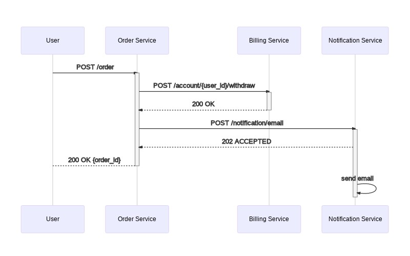
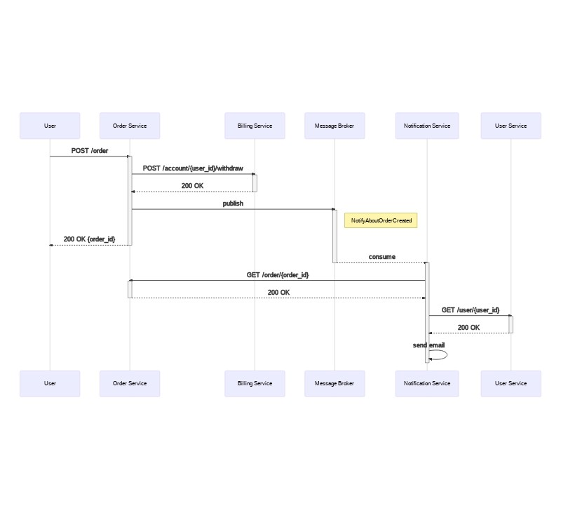
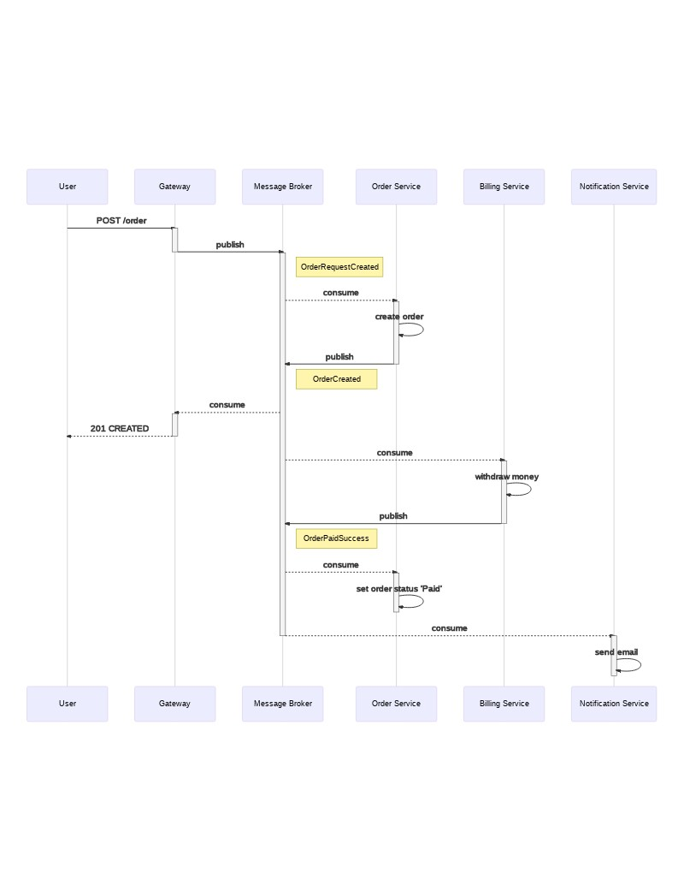

## Сервис заказа. Сервис биллинга. Сервис нотификаций.

### RESTful

[Описание REST интерфейсов](docs/restful_openapi.yaml)

Order Service выполняет роль оркестратора сервисов.
Из-за синхронной модели взаимодействия схема получилась простой, но сервис "ждет" дольше, чем мог бы.
Можно было бы отдать ответ, как только был создан заказ, а действия связанные с отсылкой почты выполнить асинхронно. 

### Event Notifications

[Описание REST интерфейсов](docs/notification_events_openapi.yaml)

[Описание ASYNC интерфейсов](docs/notification_events_asyncapi.yaml)

Отправка почты из предудыщей схемы заменена на команду, отправляемую через брокер сообщений.
В payload событии добавлен только идентификатор заказа, всю остальную информацию сервис нотификаций запрашивают по RESTful протоколу.
Это приводит к увеличению количества GET запросов. 

## Event Collaboration

[Описание ASYNC интерфейсов](docs/event-collab_asyncapi.yaml)

Процесс описывается в реактивном стиле - порождение событий и их обработка.
Для трансляции протоколов (HTTP -> MQ) необходимо использовать gateway.
Все необходимые данные приходится передавать в payload сообщения.
Необходимо уметь читать одно и то же событие в нескольких сервисах.

---

Я [реализовал схему в стиле Event Notifications](description.md), т.к. считаю, что она самая удачная - не такая сложная, как Event Collaboration, и не такая медленная, как RESTful.
  